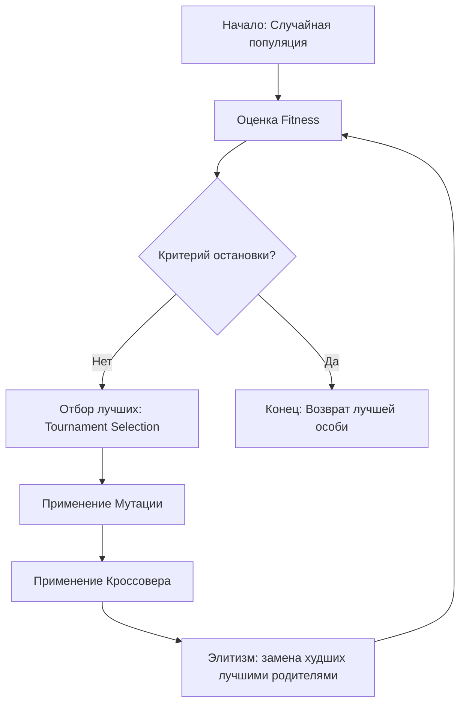

# Архитектура HEP: Компоненты и Процессы

Документация по внутреннему устройству и взаимодействию модулей движка.

## 1. Жизненный цикл Эволюции

Основной процесс оптимизации управляется классом `EvolutionaryOptimizer`. Он связывает воедино популяцию геномов и внешнюю оценку их качества.



## 2. Пайплайн трансформации данных

Процесс перевода сырых данных в расширенное признаковое пространство.

```mermaid
sequenceDiagram
    participant User as Скрипт Пользователя
    participant Opt as Optimizer
    participant Eval as FitnessEvaluator
    participant HG as Hypergraph (Genome)
    
    User->>Opt: run(evaluator, generations)
    loop Каждое поколение
        Opt->>Eval: evaluate(individual)
        Eval->>HG: transform(X, cache)
        loop Каждое гиперребро (sig, edge)
            HG->>HG: Проверка кэша по sig
            Note right of HG: Если нет в кэше - вычисляем и сохраняем
        end
        HG-->>Eval: X_hep (новые признаки)
        Eval->>Eval: np.hstack([X, X_hep])
        Eval->>Eval: Cross-Validation (Random Forest)
        Eval-->>Opt: Fitness = Score - Penalty
    end
    Opt-->>User: Лучшая модель и история
```

## 3. Взаимодействие классов

| Модуль | Класс | Ответственность |
| :--- | :--- | :--- |
| `core.py` | `Hypergraph` | Хранение топологии, MD5 сигнатуры, трансформация NumPy. |
| `evaluator.py` | `FitnessEvaluator` | Подготовка данных, обучение `sklearn` моделей, расчет фитнеса. |
| `evolution.py` | `GeneticOperators` | Алгоритмы изменения графов (Mutation, Crossover). |
| `optimizer.py` | `EvolutionaryOptimizer` | Управление популяцией, селекция и основной цикл. |
| `tracker.py` | `EvolutionTracker` | Сериализация истории в JSON для визуализации. |
| `visualizer.py` | `HEPVisualizer` | Генерация изображений и анимаций через `HyperNetX`. |

## 4. Механизм кэширования

Кэширование реализовано на уровне `FitnessEvaluator` и передается в `Hypergraph.transform`. 
- **Ключ**: MD5 сигнатура ребра (`func:node1,node2...`).
- **Значение**: Вычисленный вектор (столбец) для всего датасета.
Это позволяет избежать вычисления `sum(X0, X5)` тысячи раз, если это ребро появилось в разных особях или поколениях.
