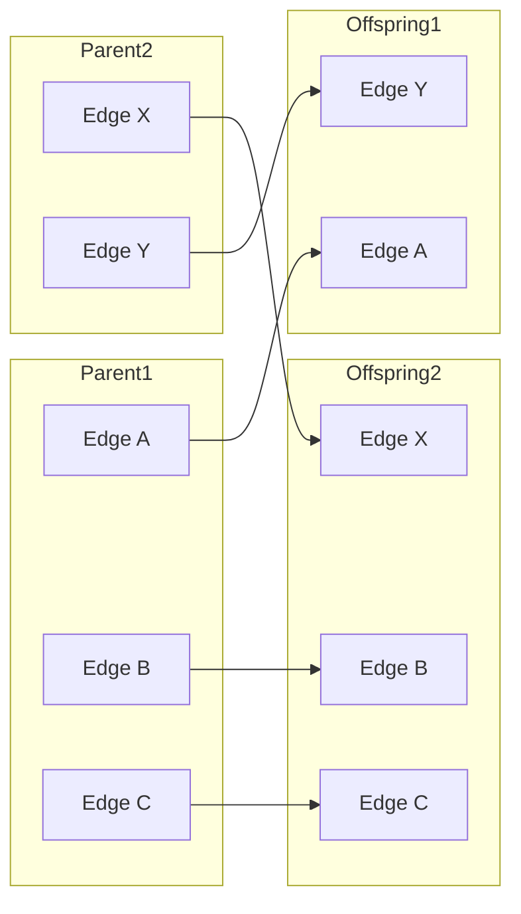

# Генетические операторы HEP: Топологическая эволюция

В отличие от классического генетического программирования (GP), работающего с деревьями, HEP оперирует наборами гиперребер. Это требует специфических подходов к мутации и скрещиванию.

## 1. Структурная Мутация (Topological Mutation)

Мутация в HEP направлена на поиск оптимального баланса между сложностью признака и его предсказательной силой. В классе `GeneticOperators` реализованы три типа воздействий:

### Тип A: Добавление (Add)
Создается совершенно новое гиперребро.
- **Арность (Arity)**: Выбирается случайно от 2 до 4 (по умолчанию). Это позволяет сразу искать взаимодействия высокого порядка.
- **Функция**: Случайный выбор из доступного реестра (`sum`, `prod`, `max` и т.д.).
- **Узлы**: Случайная выборка индексов исходных признаков.

### Тип B: Удаление (Remove)
Случайное гиперребро исключается из генома. 
> [!NOTE]
> Этот оператор критически важен для борьбы с "раздуванием" (bloat) совместно с `complexity_penalty`. Он убирает признаки, которые не дают значимого прироста к фитнесу.

### Тип C: Модификация (Modify)
Точечное изменение существующего ребра (50/50 вероятность):
1.  **Смена функции**: Замена математического оператора (например, `sum` на `max`) при сохранении тех же входных признаков.
2.  **Смена связи**: Замена одного из индексов входящих признаков на другой. 

---

## 2. Гиперграфовый Кроссовер (Macro-Crossover)

В HEP применяется **одноточечный кроссовер на уровне списков ребер**. Это макро-операция, которая позволяет особям обмениваться целыми вычислительными блоками.

**Механика:**
1. Берутся два родителя (например, с 3 и 5 ребрами).
2. Выбираются случайные точки разрыва в их списках ребер.
3. Потомки получают "голову" одного родителя и "хвост" другого.

> [!IMPORTANT]
> **Автоматическая дедупликация**: Если в результате кроссовера особь получает два идентичных ребра (например, от обоих родителей), механизм сигнатур (MD5) в классе `Hypergraph` автоматически схлопнет их в одно, предотвращая избыточность вычислений.

---

## 3. Сравнение с теоретической моделью

| Тезис | Реализация в коде | Комментарий |
| :--- | :--- | :--- |
| Изменение арности (arity) | `mutate(add)` | В текущей версии арность фиксируется при создании ребра (2-4). Изменение количества узлов в *существующем* ребре реализовано через замену узла. |
| Глобальная экспансия | `mutate(add)` | Позволяет захватывать новые признаки, не задействованные ранее. |
| Макро-скрещивание | `crossover()` | Реализовано как обмен наборами функциональных блоков. |
